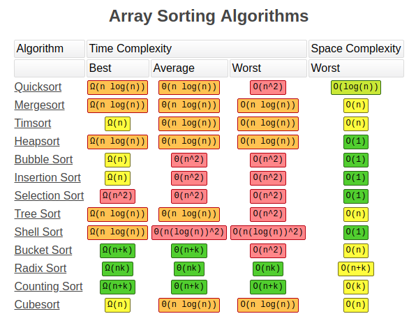

### Алгоритм сортировки

- Алгоритм сортировки виды
  - Простая (Simple)
    - Сортировка пузырьком (Bubble sort)
    - Сортировка вставкой (Insertion sort)
    - Сортировка выбором (Selection sort)
  - Эффективные (Effective)
    - Сортировка слиянием (Merge sort)
    - Сортировка быстрая (Quick sort)
    - Сортировка пирамидальная (Heap sort)
  - Специальные (Special)
    - Сортировка подсчетом (Counting sort)
    - Сортировка поразрядная (Radix sort)

---

### Course

- https://kz.hexlet.io/courses/basic-algorithms/lessons/sorting/theory_unit
- https://leetcode.com/problems/height-checker/editorial/
- todo nabu after watching decide to delete or save, and write what you learned, and make (конспект) notes
- https://www.youtube.com/watch?v=-btRl-9b5oM&list=WL&index=17

--- 

### Algorithm array sort complexity

