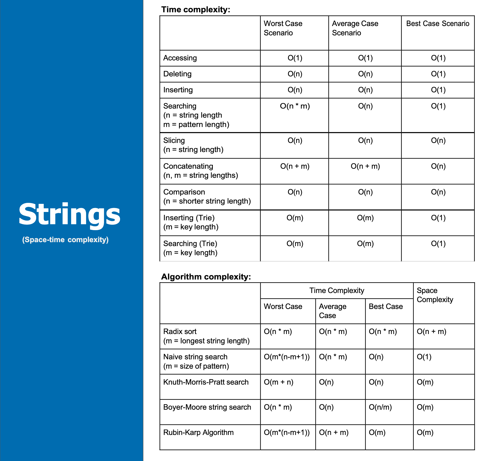

## Алгоритм обработки строк

- Алгоритм обработки строк виды
  - Алгоритм Кнуту-Морриса-Пратта (для поиска подстроки) (Knuth-Morris-Pratt Algorithm)
  - Алгоритм Бойера-Мура
  - Суффиксное дерево
  - Z-алгоритм
  - Поиск подстроки в строке (Substring Search)

**Big-O String**

- https://github.com/Hunter3-16/DSA-Notes/blob/main/Time%20Complexity.pdf
- 

