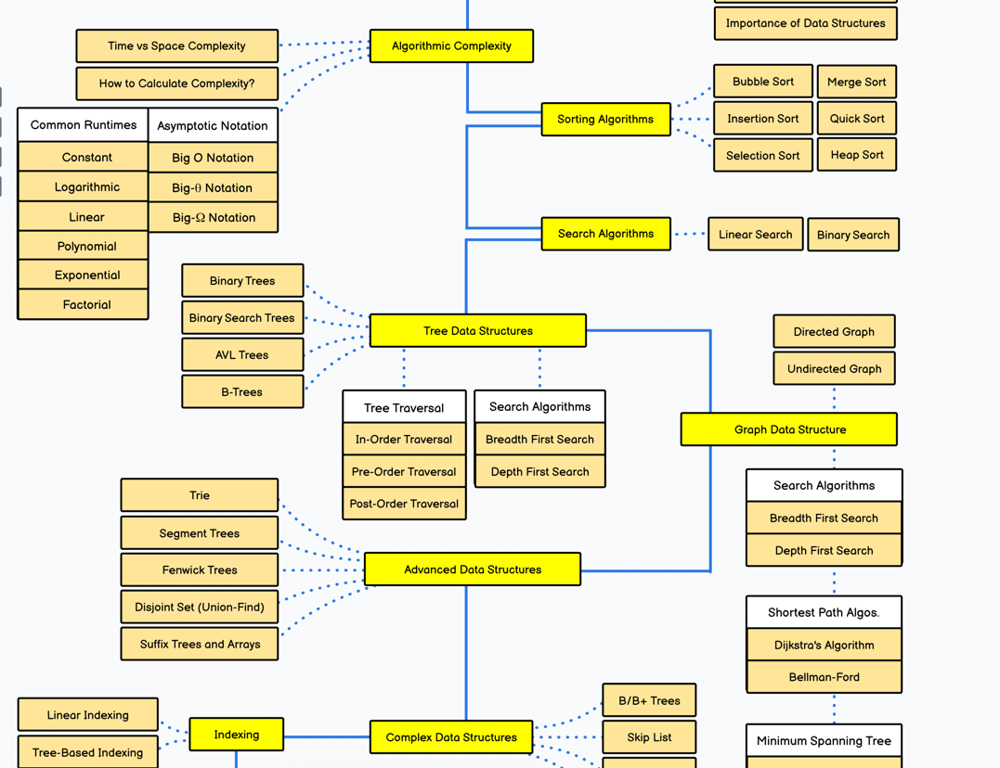
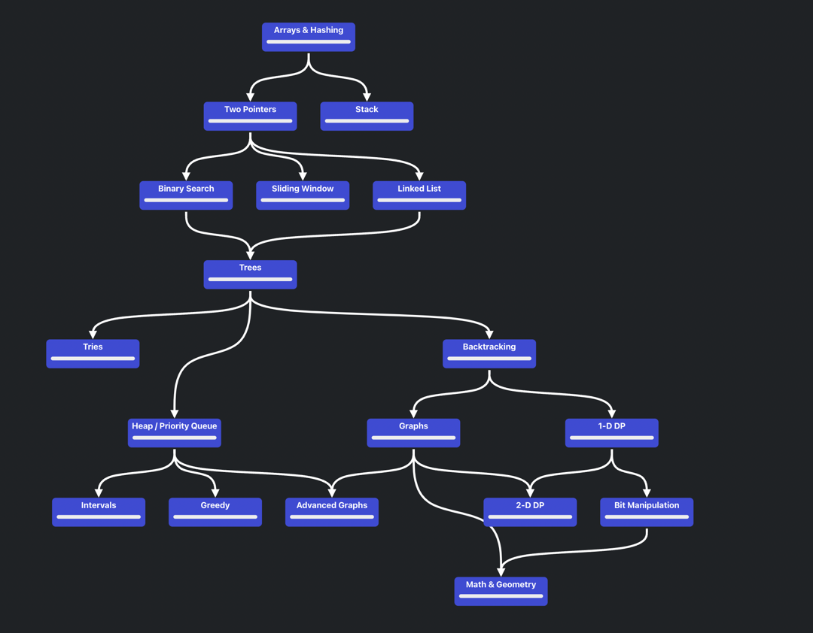
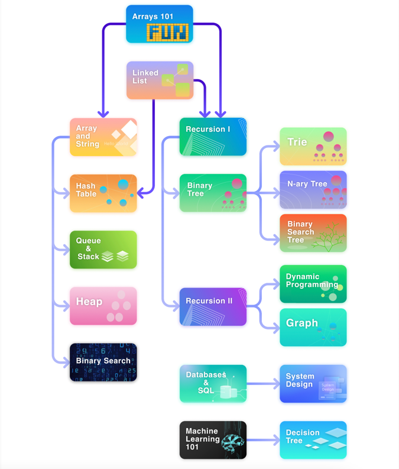

### Books

- `Algorithms + Data Structures = Programs` Niklaus Wirth
  - `Алгоритмы и структуры данных`. Новая версия для Оберона, Вирт Никлаус
  - говорят топ

- `Introduction To Algorithms`  By Thomas H Cormen, Charles E Leiserson, Ronald L Rivest, Clifford Stein · 2001
  - `Алгоритмы. Построение и анализ` Томас Кормен, Чарльз Лейзерсон, Рональд Ривест, Клиффорд Штайн.
  - говорят топ
- `Грокаем алгоритмы` Бхаргава Адитья
  - https://kaspi.kz/shop/p/bhargava-a-grokaem-algoritmy-illjustrirovannoe-posobie-dlja-programmistov-i-ljubopytstvujuschih-100124576/?m=6372001&utm_source=google&utm_medium=cpc&utm_campaign=shop_google_performance_max_2k-10k&gad_source=1&gclid=Cj0KCQiA0fu5BhDQARIsAMXUBOI-Vli7qEKCwGaeZUrmZIBZxHXMByPGDNoHw9aimzRJkcbqDidqzBAaAqh2EALw_wcB
  - говорят топ
- `Искусство программирования для ЭВМ` Трехтомник Дональда Кнута
  - `Искусство программирования`. Том 1. Основные алгоритмы, Кнут Дональд Эрвин
  - говорят приобрести все тома
- `Алгоритмы. Самый краткий и понятный курс` — Луридас Панос
- `Алгоритмы на Java` — Роберт Седжвик // прочитать отзыв
- `Структуры данных и алгоритмы в Java. Классика Computers Science` (2-е издание) — Лафоре Роберт // прочитать отзыв

----

### Roadmap

**data structure and algorithms common roadmap**

- https://roadmap.sh/datastructures-and-algorithms
- 

**neetcode algorithm roadmap**

- https://neetcode.io/roadmap
- 

**leetcode algorithm roadmap**

- https://leetcode.com/explore/learn/card/the-leetcode-beginners-guide/679/sql-syntax/4358/
- 

**leetcode algorithm and structure custom roadmap**

- https://leetcode.com/discuss/study-guide/2900390/data-structures-and-algorithms-roadmap-2023-dsa-study-guide-2023
- https://leetcode.com/discuss/study-guide/1695439/my-interview-roadmap-as-a-beginner-2022
- 

----

### Problems

**List of problems in leetcode**

- https://leetcode.com/explore/interview/card/top-interview-questions-easy/

**Two pointer problems**

- https://leetcode.com/discuss/study-guide/1688903/Solved-all-two-pointers-problems-in-100-days.

**Blind 75 leetcode problems**

- https://leetcode.com/discuss/interview-question/460599/Blind-75-LeetCode-Questions
- https://leetcode.com/studyplan/leetcode-75/
- https://www.teamblind.com/post/New-Year-Gift---Curated-List-of-Top-75-LeetCode-Questions-to-Save-Your-Time-OaM1orEU (Meta)
- https://www.techinterviewhandbook.org/grind75/

**Top 150 problems in interview leetcode**

- https://leetcode.com/studyplan/top-interview-150/

**List of topic leetcode problems**

- https://leetcode.com/discuss/study-guide/1612475/All-leetcode-discuss-lists-and-my-lists-so-far-topic-wisedifficulty-wise

===

### Solutions, course

**Solutions leetcode problems java**

- todo nabu создать для solutions отдельный файл
- todo nabu указать каждый playlist в нужные мои файлы по мере изучения, делать обновления
- todo nabu искать тоже здесь при изучении определенных тем, для того чтобы найти решения либо курс
- https://www.youtube.com/playlist?list=PLU_sdQYzUj2keVENTP0a5rdykRSgg9Wp-
- https://www.youtube.com/@EricProgramming/featured
- https://www.youtube.com/@algoseekee/featured
- https://www.youtube.com/@NeetCode/playlists

--- 

### BIG-O

**cheat sheets**

- todo nabu при прохождени тем обновлять нужные файл для каждого свой big-o data-structure
- https://www.bigocheatsheet.com/
- https://github.com/Hunter3-16/DSA-Notes/blob/main/Time%20Complexity.pdf

### Algorithm solving platform

- **Практиковаться на платформах для задач**
  - leetcode
  - hackerRank
  - CodeForces
  - Codewars

