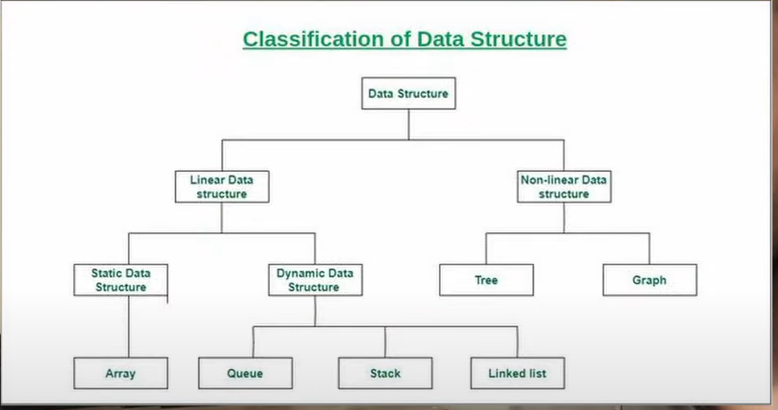

- `books`
    - Niklaus Wirth `Algorithms + Data Structures = Programs`
    - Купи трехтомник Дональда Кнута "Искусство программирования для ЭВМ"

- https://www.youtube.com/watch?v=8hly31xKli0&list=WL&index=129 Algorithms and Data Structures Tutorial - Full Course
  for Beginners

https://techdevguide.withgoogle.com/paths/data-structures-and-algorithms/?programming_languages=java

